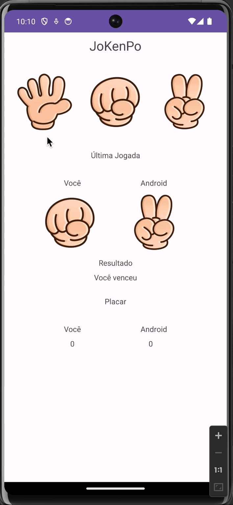

# Completion of course work

FIAP - MBA em Mobile Development - Apps, IOT, Chatbots & Virtual Assistants

Professor: [Heider Lopes](https://github.com/heiderlopes)

## Description
Playing Jokenpo against Android, the main idea here is to deepen studies in unitary and instrumented tests.

Use Model-View-ViewModel (MVVM).

## Contributing

Please read [Contributing](CONTRIBUTING.md) for details on our code of conduct, and the process for submitting pull requests to us.
## License

This project is licensed under the MT License - see the [License](LICENSE.md) file for details

## Acknowledgments

* [Heider Lopes](https://github.com/heiderlopes)